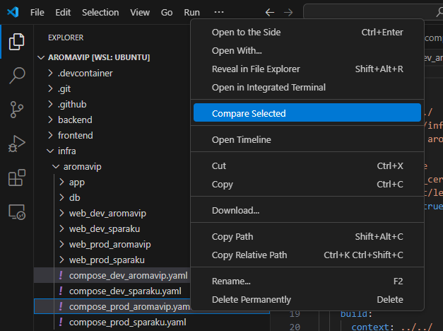
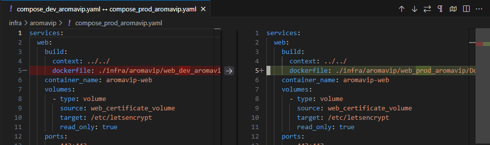
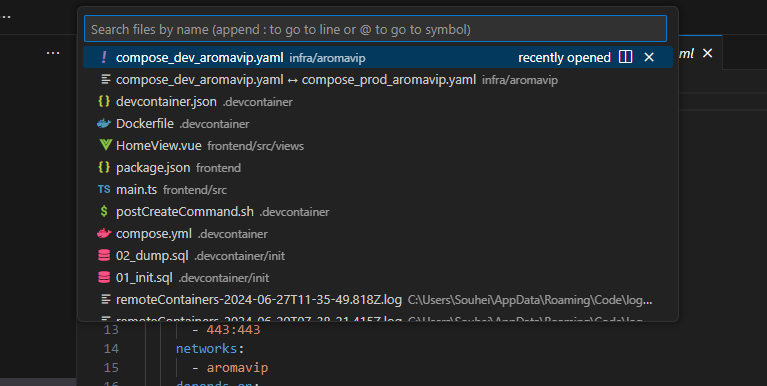
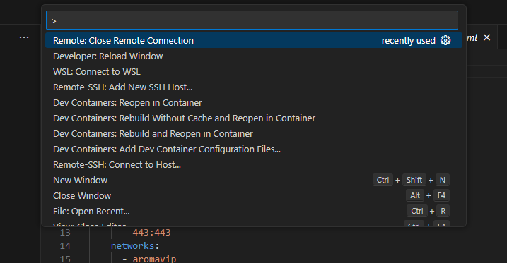
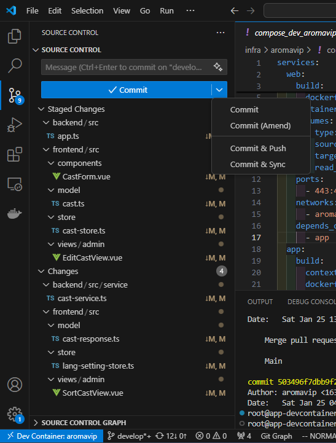
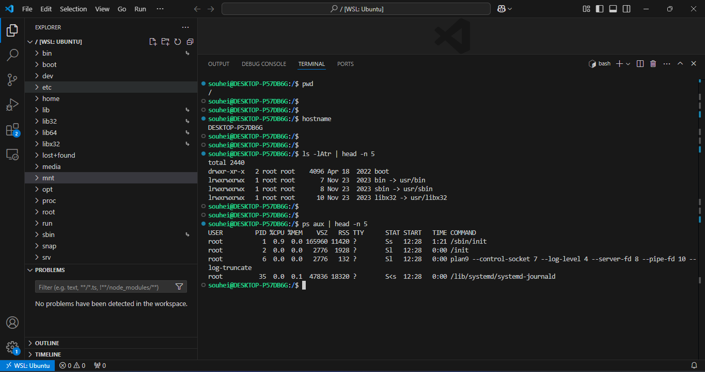
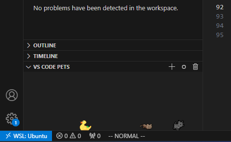
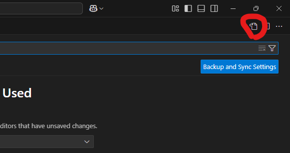
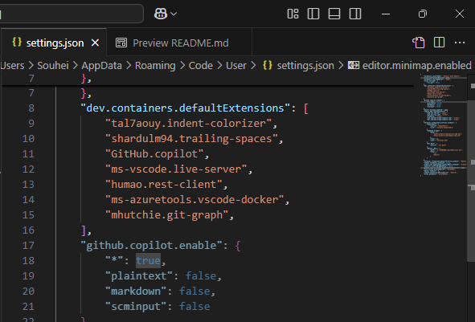

# VSCodeのあれこれ
## 前置き
- エディタとしての基本機能については割愛とし、便利かつ微ニッチな機能を中心に紹介する
- 私自身、体系的に学んだわけではないのでご留意いただきだい
- 私の偏見や勘違いが混ざっているかも...

## VSCodeとは
- Microsoftの開発する無料テキストエディタ
- 初期設定でもテキストエディタとして優秀
- 拡張機能や設定を入れていくことで有料エディタを凌ぐIDEになる

## 機能の紹介
拡張機能なしで利用できる機能を紹介

### CLIによるVSCode起動
GUIではなくCLIでVSCodeを起動できる。  
`-r`オプションで現在のウインドウで開いたりもできる。
```
code hoge-project
```

### ファイル間の差分比較
二つのファイルを選択し、差分を確認できる。  



### ファイル名検索
`Ctrl + P`でファイル名検索ができる。


### コマンドパレット
`Ctrl + Shift + P`でVSCodeの様々な機能を呼び出せる。  
ホームポジションを離れることなく色々操作できるので便利。  
拡張機能の機能もここから呼び出せる。  


### Git
Gitの基本的な操作であれば初期搭載のGit機能でGUI操作できる。  
私はステージングと差分確認でのみ使っている。  
ここは実演した方がよいかも...  


## 拡張機能

### リモート系

#### WSL
WSLからVSCodeを起動できる。  
そのままファイルやコマンド操作をすることができる。  

https://marketplace.visualstudio.com/items?itemName=ms-vscode-remote.remote-wsl

#### Dev Container
DockerコンテナからVSCodeを起動できる。
そのままファイルやコマンド操作をすることができる。  
チーム開発では超絶オススメ！  
IaCなのでアプリコードと一緒に環境情報をGit管理し、新規参画者は最低限の環境構築で開発を始めることができる。  
DBの初期化処理を組み込めばローカルですぐサンプルデータをいじれる。 　
拡張機能も設定に組み込み、共有できる。  
https://marketplace.visualstudio.com/items?itemName=ms-vscode-remote.remote-containers

#### Remote - SSH
リモートサーバにSSH接続し、VSCodeを起動できる。  
そのままファイルやコマンド操作をすることができる。  
TeraTermのようなログ保存ができるから知らない。  
https://marketplace.visualstudio.com/items?itemName=ms-vscode-remote.remote-ssh

### テキストエディタ系
#### indent-colorizre
インデントを色付けしてくれる  
https://marketplace.visualstudio.com/items?itemName=tal7aouy.indent-colorizer
#### Trailing Spaces
行末にある空白を赤に色付けしてくれる。  
https://marketplace.visualstudio.com/items?itemName=shardulm94.trailing-spaces
#### Vim
Vimマスターになれる。  
稀に既存機能とショートカットキーが競合してしまうことがある...  
https://marketplace.visualstudio.com/items?itemName=vscodevim.vim

### ユーティリティ系

#### Live Share
ペアプロができる。
MicrosoftやGitHubアカウントが必要。  
https://marketplace.visualstudio.com/items?itemName=MS-vsliveshare.vsliveshare

#### GitHub Copilot
https://marketplace.visualstudio.com/items?itemName=GitHub.copilot

### その他
#### VSCode Pets
ペットが飼える！可愛い  
  
https://marketplace.visualstudio.com/items?itemName=tonybaloney.vscode-pets

### 環境系拡張機能の注意点
拡張機能によってはWindowsではなく接続先（WSL、コンテナなど）にインストールする必要がある。  

## 設定
### 設定の変更方法について
- GUI起動
  - 画面左下の設定アイコン
  - `Ctrl + ,`でショートカット
  - JSONで管理  
    設定画面右上のアイコンクリック  
    

### 設定のスコープについて
設定には複数のスコープがある。
OSユーザ < リモート < ワークスペースの順に上書きされる
- OSユーザ
  - 各員の好みの設定を入れる
  - C:\Users\Souhei\AppData\Roaming\Code\User\settings.json
- リモート(WSL、Dev Container)
  - リモート系拡張機能を利用している場合のみ有効
  - リモートの設定
  - /home/souhei/.vscode-server/data/Machine/settings.json
- ワークスペース
  - ワークスペース独自の設定を入れたい場合に利用
  - <ワークスぺースパス>/.vscode/settings.json

### おすすめ設定項目
#### ファイル末尾の空行挿入  
Gitの余計な差分回避のため。
```
"files.insertFinalNewline": true,
```

#### Gitディレクトリの表示
初期設定だと`.git`ディレクトリは表示されないため。
```
"files.exclude": {
    "**/.git": false
},
```

#### Dev Containerのデフォルト拡張機能
Dev Containerにデフォルトでインストールしたい拡張機能場ある場合に利用
```
"dev.containers.defaultExtensions": [
    "tal7aouy.indent-colorizer",
    "shardulm94.trailing-spaces",
    "GitHub.copilot",
],
```

#### GitHub Copilotの補完対象ファイル
ファイルタイプによって補完の有効無効を切り替えれる
```
"github.copilot.enable": {
    "*": true,
    "plaintext": false,
    "markdown": false,
    "scminput": false
},
```

#### ミニマップの非表示（お好みで）
```
"editor.minimap.enabled": false,
```
ミニマップはこれ  


#### オートセーブ
ファイル変更で自動的に保存する
```
"files.autoSave": "afterDelay",
"files.autoSaveDelay": 1000, // こっちはお好みで。デフォルト1000
```

#### 空白の表示
タブや空白を表示してくれる
```
"editor.renderWhitespace": "all",
```
